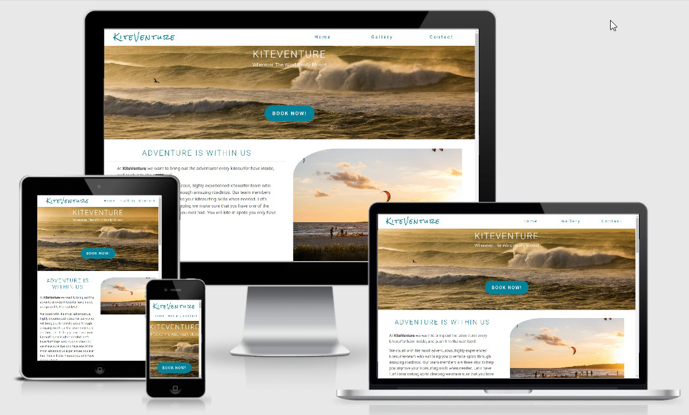
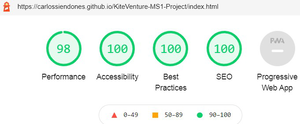
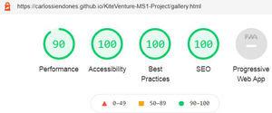
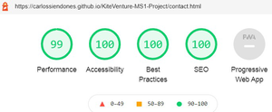

# **KiteVenture**

## **About**
**KiteVenture** is a proposal for a potential company based in Cape Town, South Africa. It is also my MS1 submission project.

**KiteVenture** is a business with kitesurfers as main focus. As the name insinuates the core concepts of the company are **Kitesurfing and Adventure**. From wherever you are in the 
World, KiteVenture will bring you to the selected starting point of our amazing road trips adventures. The least you can expect is to live in the wild for the extension of your trip. 
Sleeping, cooking, waking up, showering ... you name it!! We will make sure to bring you positively out of your comfort zone and we will reconnect you with nature. All this of course 
matched with a high dose of kitesurfing to keep you stoked all the way.

To return Home will be hard, but something inside you will have change for good, for the best.

**KiteVenture** has been working from mouth to mouth in the past. The company is looking forward to keep in touch with their current customers and to 
expand business. To have a presence online is crucial to reach their goals. 

View the live project [KiteVenture](https://carlossiendones.github.io/KiteVenture-MS1-Project/index.html).

GitHub [Repository](https://github.com/CarlosSiendones/KiteVenture-MS1-Project).

---
## **Index**

* [Strategy](#strategy)
* [Scope](#scope)
* [Structure](#structure)
* [Design](#design)
* [Skeleton](#skeleton)
* [Surface](#surface)
* [Features](#features)
* [Technologies](#technologies)
* [Testing](#testing)
* [Deploiment](#deploiment)
* [Credits](#credits)
* [Developer](#developer)
---

## **User Experience (UX)**
---
## **Strategy**
### **User stories**
**User reasons**

* A user is looking to go for a kitesurf trip.
* A user is researching to find that different adventure within kitesurfing.
* A user wants to book an adventure easily dealing directly with the KiteVenture team.
* A current customer reaches out to get information of other destinations.
* A user is looking for previous visual references from other KiteVenturers.

**Company Goals**

* Increase Bookings.
* Increase engagement with customers.
* Provide a direct contact channel for customers.
* Show potential customers what KiteVenture is all about.
---

## **Scope**
**Potential user expectations**
* A user friendly website.
* Links to social media to keep up to date.
* Attractive and fresh looking website.
* Informative site.
* To use the website in different devices.
* Contact section.

**Potential user wishes**
* As user I want to know who KiteVenture is and what do they offer.
* As user I want to hear from previous clients experiences.
* As user I want to get in touch to plan my next adventure.
* As user I want updates in new destinations.
* As user I want visual content from previous trips.
* As user I want to reach the team for any question i might have.

**Bussiness expectations**
* Provide information about KiteVenture.
* Provide a channel for customers to contact KiteVenture.
* Provide a visual overview about what KiteVenture is.
* Motivate customers to book their next adventure with KiteVenture.
* Engage with customers via KiteVenture social media channels.
---

## **Structure**

KiteVenture website has 3 pages:

1. **Home page** where you can find different sections:
    * About section.
    * Quotes.
    * Healthy reasons why.
    * Destinations.
2. **Gallery** where you can find visual content from previous trips.
3. **Contact** Where you find a contact form to reach KiteVenture.

---
## **Design**
---
## **Skeleton**
### **Layout**

* The website has been created with a responsive design, so it adapts the layout depending on the device/screen size the web is 
displayed. While in a mobile device everything displays in one column due to its size, in bigger devices like tablets, laptops, desktop 
screens the website will display in two, three or four columns depending on the section's needs.

* In order to display a clean and organised layout we have used Bootstrap for the grid system combined with containers, margins, paddings etc...

* The KiteVenture website has been designed under the philosophy of Mobile-First Design to create a better user experience,
starting the design process  from the smallest of the screens (mobile). In this way we ensure that the users experience is 
seamless on any device.

* Last but not least, we used a maximum width to ensure that in large and very large screens everything stays organised, keeping the visual proportions within the screen.

### **Wireframes**

* [Smartphone Wireframes](readme-files/kiteventure-smartphone-wireframe.png)

* [Tablet Wireframes](readme-files/kiteventure-tablet-wireframes.png)

* [Desktop Wireframes](readme-files/kiteventure-desktop-wireframe.png)

**Note:** From the wireframes to the end product we took a couple of design turns for a better user experience.

### **Am I responsive**

* [Responsive Home](readme-files/screenshot-home.png)

* [Responsive Gallery](readme-files/screenshot-gallery.png)

* [Responsive Contact](readme-files/screenshot-contact.png)

***

## **Surface**

### **Color Palette**

**HEX**

**RGB** equivalent from left to right
 * RGB(85, 85, 85)---- Davys Grey
 * RGB(2, 129, 152)--- Metallic Seaweed
 * RGB(93, 199, 217)-- Middle Blue
 * RGB(85, 85, 85)---- White

 For KiteVenture website we decide to use fresh colors that remind us the sea for the obvious connection between the sport and the playground. We wanted
 to keep the fresh look of the site without compromising the accessibility for visual impaired users, so we make sure that we are working with enough
 contrast along the website for every user. 

 Combining the color palette with the warmth of the images we want to create that feeling of being outside, in the nature, where every adventure takes place
 where KiteVenture is going to bring you.

 For the dark text we used a Davys Grey, a friendlier and fresher version of the typical black.

 ### **Typography**
 The fonts used in this project are from [Fonts Google](https://fonts.google.com/). The main typography along the whole website is **Roboto**. Its forms are largely geometric, but at the
 same time the font features friendly and open curves. For the headers throughout the website we also used **Roboto**, but in this case we played with its size, weight and letter spacing
 for readability and hierarchy of importance.

 For our logo we used **Rock & Salt**. It is a hand crafted font that gives a fresh, casual and natural look to our logo introducing from the very beginning the 
 feeling of adventure to the user. 

 If for any reason the browser used does not support this fonts there are backup fonts assigned to replace the ones we choose.
 
 Below we can find the imported code from  [Fonts Google](https://fonts.google.com/) to the top of our css file.

 @import url('https://fonts.googleapis.com/css2?family=Roboto:wght@300;400;500&family=Rock+Salt&display=swap');

### **Call to action**
We used different techniques for our call in actions, all of them very intuitive for the user to click

* For the logo and the navigation bar when we hover we notice that it change the color telling us that we can do something with it. In this case the call 
to action are the words themselves. We also used this technic for the email address and location in the footer, linking them to an email and to google maps respectively
.

* For the call to action that leads us to the contact form we designed a button, also with a hover effect that exchanges the color of the button for the 
color of its text as we hover it. This buttons can be for **Contact us** , **Book now**, or **Submit**.

* For the Social Media call to actions, we didn't create any effects on them since for users in general to click on them is almost a natural reaction. 

### **Imagery**

Given that the website is a proposal for a potential customer we have not actual images from this company at the moment, in the future we will need just 
to replace the images. All the images of the website have been downloaded from [Unsplash](https://unsplash.com/).

The images have been selected to induce the user in a state of need for an adventure. We went for strong and clean images to give the website more attractiveness, and to turnover in to more bookings.

Below you will find the file with the images from the whole website and the authors will appear in the **credits** section.

[Images](assets/images) folder.

---
## **Features**

### **General features throughout the website**

**Navigation Bar and Logo**

At the top of each page of the website we find the Navigation Bar and the Logo. Since both elements are call to action elements
when we hover on them they change color to improves accessibility. The **logo** no matter in which page you are, 
will bring you back to Home page. Each call to action element of the **Navigation Bar** will bring you to the it's
designated page of the web site. Since we have only three pages in this website we decided to do not collapse the
navigation bar in small devices, instead we bring it under the logo and centred both logo and navigation bar.
And in bigger screens they will be aligned for better visual appeal.

**Footer**

At the bottom of each page we will find the footer. This is divided in three sections **Contact info**, **Contact us** 
call to action button and **Social media**. In mobile device we will find this sections stacked while in bigger devices 
we will find them in three columns.

In the **Contact info** section we find a contact phone number that you can use in a mobile device to call directly, 
a contact email address linked to your email service so you can write and send an email right away from any device and 
the location of the company linked to a pin in Google maps so in case the user wants to visit the company will be very 
easy to find it.

The second section of the footer is a **Contact us** call to action button linked to the contact form for better
accessibility,user experience and potentially conversions in bookings.

Last but not least the **Social Media** section with the logo-link of each media channel the company uses. So the user 
can straight away click and follow to stay tuned for the latest news from KiteVenture and to reach the desired engagement 
from the customer.

**Accessibility**

We put a lot of attention in users with visual impairments, so all the images and navigations have alt or aria-label attributes 
so it is easier to navigate for them, also we made sure that the contrast along the website has enough contrast. To cope with 
the hierarchy throughout the website we use header elements in sequence.

**Responsiveness**

We create the website starting from **mobile first philosophy** and scaling up and down for different screen sizes we might find.
This will make the web site look good in any device. 

**Metadata**

We labelled each page by its name so if the user has more than one page open can recognise easily where is at the moment or where 
to go. We also add keywords to increase traffic to the site.

### **Features per page**
**Home**
* A strong welcome **Hero Image** with a slogan to induce the user in to the adventure feeling from the very beginning and a **book now** 
button for those users who already know what they want.

* An **About us** section to let new users who Kiteventure is and what do they do with an image reminder of it.

* A **Quotes section** where we show what previous KiteVenturers think about us.

* In our **Why KiteVenture** section we decide to mix the "why" with "healthy reasons" to tell our users why to choose us. This end up 
in **Healthy reasons why KiteVenture** section, because we believe adventures adds numerous positive effects to everybody's health.

* Finally we arrive to our main **Destinations** section. *Please notice that at the moment these destinations are linked to the contact form since 
our trips are made personally and depending on the conditions for the main activity which is Kitesurfing*.

**Gallery**
* In this page we find only a **Gallery** section. We think that a gallery in this kind of business it is really important to we give it its own 
page. This is a simple but effective and more important, responsive gallery. It goes from one column in the smaller screens all the way to four for bigger screens.

**Contact**

* The **Form** is built in a jumbotron structure. It has a background image for visual appealing and keeping the adventurous feeling we started in the home page with the 
hero image until the very end. Then we have the form with a background with our medium blue color, we reduce opacity in this case so we can still enjoy the image behind it.

* The form includes:
    * **Name** and **Last Name** input fields.
    * **Email** input field, requiring the input to be a email.
    * **Phone Number** input field, requiring the input being a number.
    * **Request** is a check list, for the user to choose what kind of request wants to do.
    * **Comments** input field, for the user to add additional comments, questions, etc...
    * **Submit** button. It will change the color when hovered over.*Please Note at the moment this submit button will send you to a 405 not allowed page. We could also link it back to the home page or somewhere else 
    but it would have the same effect so the data will not be send it anyways. When we acquire the skills we will work on it.
    * For the form to be send it requires at least a valid Name, Last Name, Email and Phone number. The labels are clear as to what is required in each field.

### **Features to come**
* **Collapse Navigation Bar**. As the website grows and will need more pages we will collapse the NavBar first in smaller devices and if needed in bigger devices.
* **Carousel for quotes**. When we add some more quotes we will create a carousel for better user experience.
* **Submit verification message**.
* **Online Payment Methods**.
* **More Destinations**.
* **Linked info to the destinations**.
* **Biography of team members**.

---

## **Technologies used**
### **Core technologies**

* **HTML 5** to create the structure of the website.

* **CSS** to style the website.

* **Gitpod** for writing the code, commit it and push it to Github.

* **GitHub** for hosting the repository.

* **Git** for version control of the project when/if needed.

### **Design technologies**

* [Bootstrap](https://getbootstrap.com/) for the grid system.

* [Free for Matter](https://www.freeformatter.com/) to beautify html and css.

* [Auto Prefixer](https://autoprefixer.github.io/) to make the site cross browser.

* [Fonts Google](https://fonts.google.com/) for typography.

* [Balsamiq Wireframe](https://balsamiq.com/) for wireframes.

* [Ami Responsive Design](http://ami.responsivedesign.is/) for responsiveness mockups.

* [Jpg 2 Png](https://jpg2png.com/) to convert images.

* [Coolors](https://coolors.co/) to create color palette.

* [I Love Img](https://www.iloveimg.com/) to resize images.

### **Testing technologies**
* [Markup Validation Service](https://validator.w3.org/) to validate html.

* [Jigsaw](https://jigsaw.w3.org/css-validator/) to validate css.

* [Ami Responsive Design](http://ami.responsivedesign.is/)to test responsiveness.

* **DEV TOOLS** light house. To test performance, accessibility, best practices and search engine optimization.
---

## **Testing**
* [Live project](https://carlossiendones.github.io/KiteVenture-MS1-Project/)

* [HTML Validator](https://validator.w3.org/) Not Errors found

* [CSS Validator](https://jigsaw.w3.org/css-validator/) Not Errors Found

*Please notice to validate CSS by direct input.

[x] **Navigation Links** redirect to correct page.

[x] **Logo** returns to home page.

[x] Call to action **Contact us**, **Booking now** and **Destination** buttons redirect to contact form.

[x] Call to action **email** in footer in the section Contact Us redirects to email service.

[x] Call to action **location** in footer in the section Contact Us redirects to google maps.

[x] **Social Media** links redirect to their social media channels.

[x] **Hoover** over links are clear. *Please notice that in Social Media links it is intentional to don't have any hover effect as mention previously.

[x] **Requested inputs** in form. If the requested input is not filed properly won't be possible to submit the form.

### **Cross Browser**

The Website has been tested in:
* Internet Explorer
* Fire Fox
* Chrome
* Microsoft Edge
* Safari 
* Opera

So far we found a little issue in Internet explorer with our destination images, they don't get completely the desired shape. Overall we can say that the **cross browser test has been successful**.

### **Cross OS**

The Website has been tested in:
* iOS
* Windows 10
* Android 10

The site didn't give any problem so far in none of them.

### **Light House** Dev Tools 
We carried tests for each page in the light house Dev Tools, testing accessibility, performance, good practice and search engine optimization. We carried these tests in incognito mode to be more accurate. We Know we can improve somethings but we are very satisfied with the results. The images below 
shows in order home page, gallery and contact tests.

### **Usability**
At different stages of the design we send the project to some colleges from the slack community and also to a group of random people not connected to 
software development. With this we focus in responsiveness and user experience. When we first sent the project some testers gave very useful feedback, 
we adapted the project then to have a better user experience and accessibility. Some of the adaptations were creating links in contact us in the footer,
resize images so loading time decrease. 

We sent the project in its last version and the feedback has been very possitive from both students in the field and random potential users. 

### **Testing User Stories**

* **A user is looking to go for a kitesurf trip.** The user arrived to the right place this website specialises in kitesurf trips.

* **A user is researching to find that different adventure within kitesurfing.** To help the user decide to go for an adventure with KiteVenture we let 
them know who KiteVenture are, healthy reasons why they should go with KiteVenture, all KiteVenture destinations and the word of other KiteVenturers.
* **A user wants to book an adventure easily dealing directly with the KiteVenture team.** We provide the user with a contact form that makes very easy
to contact with the KiteVenture team. Furthermore in the footer in each page we provide with the phone number so users can contact directly with KiteVenture. 
* **A current customer reaches out to get information of other destinations.** In the contact form mention in the previous user story we have a check list for 
different purposes like quotation, information and booking.
* **A user is looking for previous visual references from other KiteVenturers.** At KiteVenture we give a lot of importance to visual references so we created 
a page exclusively for a Photo-gallery with previous user's images. For more visual references we have links to KiteVenture Social Media Channels for the user 
to stay in the loop. 
---

## **Deployment**
Github is in this case is our repository host, and Gitpod is our code editor. Now we will explain different aspects of the deployment process. *Please notice that this description 
starts from the point that we have already created a Github/Gitpod account an even a repository*. 

### **Add, Commit, Push**
How do we send the files created from Gitpod to Github? In the command line type:
* **git add .**  (to update the whole project)
* **git commit -m "Desired commit here"**
* **git push**

If we want to add all new or modified files, in the first of the three steps above mentioned will type it as it is **git add .** .*Please notice the "." after add*. To add a single file instead, 
we will use the pathway instead the "." after add (e.g. **git add README.md** or **git add assets/css/style.css**). After that we will go on with second and third step. Commit often and with clear 
explanations of what we are committing.

### **Deployment steps**
* Login in to Github
* Go to **settings** above the repository.
* Scroll down to **Github settings** section.
* Under **Source** go to the dropdown called **None**, select **Master Branch**.
* The page should then refresh automatically and a **link** of the live site should be displaced.

### **Forking**
Forking the Github repository can be very useful. If we want to work and make changes without this to affect to the original repository, for testing new features for example.

* Login to Github and go to the Repository you want to fork.
* Go to the **Fork** button above the Repo. 
* By now you should have a copy of the original repository in your Github.

---

## **Credits**

* **CODE INSTITUE** for all the program/lessons, tutor assistance, student care.

* **Brian Macharia** Mentor from CODE INSTITUTE. For all the advice and support throughout the MS1.

* **Slack Community** for all the support from fellow students to tutors.

* **Students WhatsApp Group** for being so supportive to one another technically and motivationally. Special mention to **Rebecca Kelsall** to cheer me up big time when i was in the deepest during the MS1.

* [Imagery Credits here](readme-files/imagery-credits.md).

* **Teams behind all the technologies used** during this project. Please see **technologies used** section.
---

### **Developer**
* **Carlos Siendones**
---

