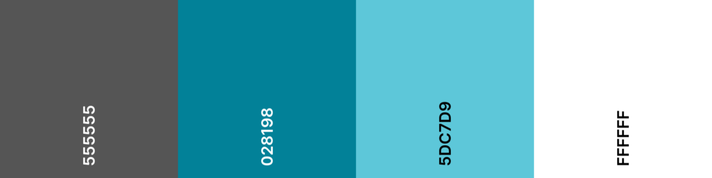

# **KiteVenture**
## **About**

KiteVenture 

View the live project [here](https://carlossiendones.github.io/KiteVenture-MS1-Project/index.html)
[Other](#other)

---

## **User Experience (UX)**
## **Strategy**
### **User stories**
**User reasons**

* A user is looking to go for a kitesurf trip.
* A user is researching to find that different adventure within kitesurfing.
* A user wants to book an adventure easily dealing directly with the KiteVenture team.
* A current customer reach out to get information of other destinations.
* A user is looking for previous visual references from other KiteVenturers.

**Company Goals**

* Increase Bookings.
* Increase engagement with customers.
* Provide a direct contact chanel for customers.
* Show potential customers what KiteVenture is all about.

## **Scope**
**Potential user expectations**
* A user friendly website.
* Links to social media to keep up to date.
* Attractive and fresh looking website.
* Informative site.
* To use the website in different devices.
* Contact section.

**Potential user wishes**
* As user i want to know who KiteVenture is and what do they offer.
* As user i want to hear from previous clients experinces.
* As user i want to get in touch to plan my next adventure.
* As user i want updates in new destinations.
* As user i want visual content from previous trips.
* As user i want to reach the team for any question i might have.

**Bussiness expectations**
* Provide information about KiteVenture.
* Provide a channel for customers to contact KiteVenture.
* Provide a visual overview about what KiteVenture is.
* Motivate customers to book their next adventure with KiteVenture.
* Engage with customers via KiteVenture social media channels.

## **Structure**

KiteVenture website has 3 pages:

1. **Home page** where you can find diferent sections:
    * About section.
    * Quotes.
    * Healthy reasons Why.
    * Destinations.
2. **Gallery** where you can find visual content from previous trips.
3. **Contact** Where you find a contact form to reach KiteVenture.

---
## **Design**
---
## **Skeleton**
### **Layout**

* The website has been created with a responsive design , so it adapts the layout deppending on the device/screen size the web is 
displayed.While in a mobile device everything displays in one column due to its size, in bigger devices like tablets, laptops, desktop 
screens the website will display in two, three or four columns depending on the sections needs.

* In order to display a clean and organised layout we have used Bootstrap for the grid system combined with containers, margins, paddings etc...

* The KiteVenture website has been designed under the philoshopy of Mobile-First Design to create a better user experience,
starting the design process  from the smallest of the screens (mobile). In this way we ensure that the users experience is 
seamless on any device.

* Last but not least , we used a maximum width to ensure that in large and very large screens everyhing stays organised, keeping the visual proportions within the screen.

### **Wireframes**

* [Smartphone Wireframes](readme-files/kiteventure-smartphone-wireframe.png)

* [Tablet Wireframes](readme-files/kiteventure-tablet-wireframes.png)

* [Desktop Wireframes](readme-files/kiteventure-desktop-wireframe.png)

**Note:** From the wireframes to the end product we we took a cuople of design turns for a better user experience.

### **Am I responsive**

* [Responsive Home](readme-files/screenshot-home.png)

* [Responsive Gallery](readme-files/screenshot-gallery.png)

* [Responsive Contact](readme-files/screenshot-contact.png)

***

## **Surface**

### **Color Palette**

**HEX**

**RGB** equivalent from left to right
 * RGB(85, 85, 85)---- Davys Grey
 * RGB(2, 129, 152)--- Metalic Seaweed
 * RGB(93, 199, 217)-- Middle Blue
 * RGB(85, 85, 85)---- White

 For KiteVenture website we decide to use fresh colors that remind us the sea for the obvious connection between the sport and the playground. We wanted
 to keep the fresh look of the site without compromising the accesibility for visual impared users, so we make sure that we are working with enought
 contrast along the website for every user. 

 Combining the color palette with the warmth of the images we want to create that feeling of being outside, in the nature, where every adventure takes place
 where KiteVenture is gonna bring you.

 For the dark text we used a Davys Grey , a friendlier and fresher version of the typical black.

 ### **Typography**
 The fonts used in this project are from [Fonts Google](https://fonts.google.com/). The main typography along the whole website is **Roboto**. Its forms are largely geometric, but at the
 same time the font features friendly and open curves. For the headers throughout the website we also used **Roboto**, but in this case we played with its size, weight and letter spacing
 for readability and hierarchy of importance.

 For our logo we used **Rock & Salt**. It is a hand crafted font that gives a fresh, casual and natural look to our logo introducing from the very begining the 
 feeling of adventure to the user. 

 If for any reason the browser used does not support this fonts there are backup fonts asigned to replace the ones we choosed.
 
 Below we can find the imported code from  [Fonts Google](https://fonts.google.com/) to the top of our css file.

 @import url('https://fonts.googleapis.com/css2?family=Roboto:wght@300;400;500&family=Rock+Salt&display=swap');

### **Call to action**
We used different techniques for our call in actions, all of them very intuitive for the user to click

* For the logo and the navigation bar when we hover we notice that it change the color telling us that we can do somthing with it. In this case the call 
to action are the words themself. we also used this technic for the email address and location in the footer, linking them to an email and to googlemaps respectively
.

* For the call to action that leads us to the contact form we designed a button, also with a hover effect that echanges the color of the button for the 
color of its text as we hover it. This buttons can be for **Contact us** , **Book now**, or **Submit**.

* For the Social Media call to actions, we didn't create any effects on them since for users in general to click on them is almost a natural reaction. 

### **Imagery**

Given that the website is a proposal for a potential customer we have not actual images from this company at the moment, in the future we will need just 
to replace the images. All the images of the website have been downloaded from [Unsplash](https://unsplash.com/).

The images has been selected to induce the user in a state of need for an adventure. Strong clean images to give the website more attractiviness, and to turnover in to more bookings.

Below you will find the file with the images from the whole website and The authors will appear in the **credits** section.

[Images](assets/images) folder.

## **Features**

### **General features throughout the website**

**Navigation Bar and Logo**

At the top of each page of the website we find the Navigation Bar and the Logo. Since both elements are call to action elements
when we hover on them they change color to improves accessibility. The **logo** no matter in which page you are, 
will bring you back to Home page. Each call to action element of the **Navigation Bar** will bring you to the its
designated page of the web site. Since we have only three pages in this website we decided to do not colapse the
navigation bar in small devices, instead we bring it under the logo and centered both logo and navigation bar.
And in bigger screens they will be aligned for better visual apeal.

**Footer**

At the bottom of each page we will find the footer. This is ddivided in three sections **Contact info**, **Contact us** 
call to action button and **Social media**.In mobile device we will find this sections stacked while in bigger devices 
we will find them in three columns.

In the **Contact info** section we find a contact phone number that you can use in a mobile device to call directly, 
a contact email address linked to your email service so you can write and send an email right away from any device and 
the location of the company linked to a pin in Google maps so in case the user wants to visit the company will be very 
easy to find it.

The second section of the footer is a **Contact us** call to action button linked to the contact form for better
accesibility,user experience and potentially convertions in bookings.

Last but not least the **Social Media** section with the logo-link of each media channel the company uses. So the user 
can straight away click and follow to stay tuned for the latest news from KiteVenture and to reach the desired engagement 
from the customer.

**Accesibility**

We put a lot of attention in users with visual impairments, so all the images and navigations have alt or aria-label atributes 
so it is easier to navigate for them, also we made sure that the contrast along the website has enought contrast. To cope with 
the hierarchy throughout the website we use header elements in sequence.

**Responsiviness**

We create the website starting from **mobile first philosophy** and scaling up and down for different screen sizes we might find.
This will make the web site look good in any device. 

**Metadata**
we labeled each page by its name so if the user has more than one page open can recognise easily where is at the moment or where 
to go. We also add keywords to increase traffic to the site.

### **Features per page**
**Home**
* A strong welcome **Hero Image** with a slogan to induce the user in to the adventure feeling from the very begining and a **book now** 
button for those users who already know what they want.

* An **About us** section to let new users who Kiteventure is and what do they do with an image reminder of it.

* A **Quotes section** where we show what previous KiteVenturers think about us.

* In our **Why KiteVenture** section we decide to mix the "why" with "healthy reasons" to tell our users why to choose us. This end up 
in **Healthy reasons why KiteVenture** section , because we believe adventures adds numerous positive effects to everybody's health.

* Finally we arrive to our main **Destinations** section.*Please notice that at the moment this destinations are linked to the contact form since 
our trips are made personally and deppending on the conditions for the main activity which is Kitesurfing*.

**Gallery**
* In this page we find only a **Gallery** section. We think that a gallery in this kind of bussines it is really important to we give it its own 
page. This is a simple but effective and more important, responsive gallery.It goes from one column in the smaller screens all the way to four for bigger screens.

**Contact**

### **Features to come**

## **Technologies used**
### **Core technologies**

* **HTML 5** to create the structure of the website.

* **CSS** to style the website.

* **Gitpod** for writing the code , commit it and push it to Github.

* **GitHub** for hosting the repository.

* **Git** for versiion control of the project when/if needed.

### **Design technologies**

* [Bootstrap](https://getbootstrap.com/) for the grid system.

* [Free for Matter](https://www.freeformatter.com/) to beautify html and css.

* [Auto Prefixer](https://autoprefixer.github.io/) to make the site cross browser.

* [Fonts Google](https://fonts.google.com/) for typography.

* [balsamiq Wireframe](https://balsamiq.com/) for wireframes.

* [Ami Responsive Design](http://ami.responsivedesign.is/) for responsiviness mockups.

* [Jpg 2 Png](https://jpg2png.com/) to convert images.

* [Coolors](https://coolors.co/) to create color palette.

* [I Love Img](https://www.iloveimg.com/) to resize images.

### **Testing technologies**
* [Markup Validation Service](https://validator.w3.org/) to validate html.

* [Jigsaw](https://jigsaw.w3.org/css-validator/) to validate css.

* [Ami Responsive Design](http://ami.responsivedesign.is/)to test responsiviness.

* **DEV TOOLS** light house. To test performance , accesibility, best practices and search engine optimization.\

## **Testing**
## **Deployment**

## **Credits**
[Imagery Credits](readme-files/imagery-credits.md)
### **Content**
### **Media**
### **Other**